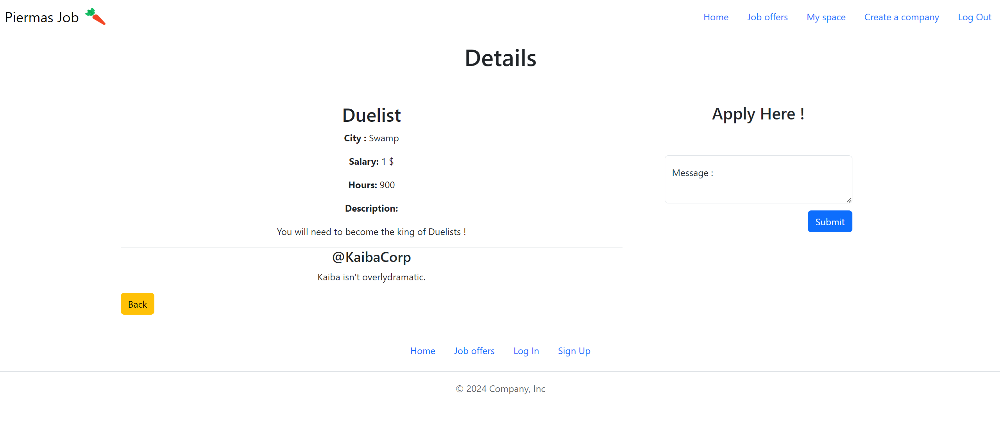

# WEB501 Project

The stack uses react and vite to bundle it and the bun runtime.
For the backend api and to serve the static react app we'll use Express. 


# How to setup.

- Install your own mysql database and create a user for the App to use.
- First start by renaming a copy of [env.example.json](./env.example.json) and [secrets.example.json](./secrets.example.json) as env.json and secrets.json.
- Fill in their content.
- Install the [bun javascript / typescript  runtime](https://bun.sh/).
- Intall dependencies using ```bun install```.

Here are some of the available scripts : 
- ```bun run dev``` This starts devoppment servers. It has hot realoading for the front end.
- ```bun run build``` Will bundle the react front end for production.
- ```bun run clean``` Removes last front end build.
- ```bun run start``` Builds and starts the production build. (Some typescript needs some cleanup before this to run)

## Step 1

Database access is done through an ORM, [Sequelize](https://sequelize.org/docs/v6/).

Datamodels are located at 
- [User.ts](./dataModels/User.ts)
- [Company.ts](./dataModels/Company.ts)
- [Offer.ts](./dataModels/Offer.ts)
- [Application.ts](./dataModels/Application.ts)

And are initialized in
- [databse.ts](./dataModels/database.ts)

## Step 2


## Step 3


## Step 4

We spread our crud in files based on each route.
- [user.ts](./api/user.ts)
- [company.ts](./api/company.ts)
- [offer.ts](./api/offer.ts)
- [application.ts](./api/application.ts)

Each file contains all 4 CRUD operations on each according data model. It may contain exta subroutes on top of that.

## Step 5 + 6


User must be logged in, name and contacts will be shared through database



User data are pulled from the accound, a personalised message can be left. After submitting the message gets saved as default for next time.


Application may be edited from here if needed.


Users may edit any of their data except their name from their profile.


An user can register his company.


Once registered or being memeber of a company, one may manage it through this page, it also displays ongoing offers.


If you already belong to the company an offer belongs to, you may edit it instead of applying.


You can also view and manage applications to the offers.

## Step 7


If you are logged in as an account tagged as admin in the database, an admin tool link apears.
The admin value needs to me manualy set to 1 in the database for that user to become an admin.


You can edit any entry in the database individualy, also bypassing regular api permission restrictions.
Admin check is done serverside using sessions.


You can also create new entries in the database.
Using the reload button is nessecary after creating for the editor to be created.

## Task 8

Lots of input validation in forms.

